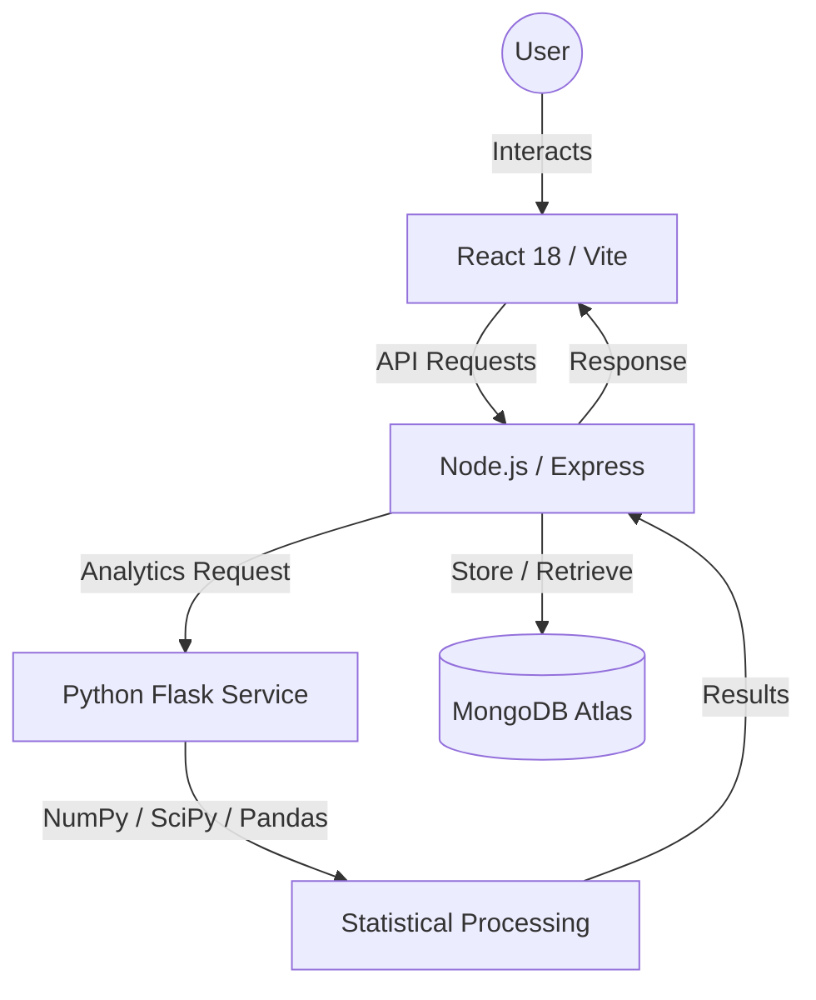

# VIDYUT (विद्युत) ⚡
### High-Fidelity Energy Intelligence & Bharat-Aware Analytics

**Vidyut** is a next-generation energy monitoring ecosystem designed to transform raw electricity usage into high-fidelity actionable intelligence. Unlike generic dashboards, Vidyut combines a **Luxe UI/UX design philosophy** with a specialized **Python-powered statistical microservice** tailored for the Indian energy landscape (Bharat).

---

## 🌟 Key Features

### 🧠 Bharat Intelligence Engine
The heart of Vidyut is its context-aware analytics engine that understands Indian household consumption patterns:
- **Seasonal Multipliers**: Automatically adjusts "Normal" usage baselines for Indian Summer (Peak AC Load, Apr-Jun) and Festive Seasons (Oct-Nov).
- **Urban Baseline Modeling**: Calculates typical urban Indian household steady-state consumption (8-25 kWh range).
- **Peak Hour Sensitivity**: Specialized monitoring during Indian peak grid hours (6 PM – 10 PM).

### 🛡️ Sentinel Anomaly Detection
Advanced protection against billing shocks and appliance failures:
- **Z-Score Intensity**: Every reading is evaluated against statistical variance.
- **Breach Ratio Model**: Spikes exceeding a **2.5x seasonally-adjusted threshold** trigger instant Sentinel Alerts.
- **Fault Detection**: Identify faulty wiring or geysers left on through high-frequency spike analysis.

### 💎 Luxe Design System
A premium interface engineered for visual comfort and "gallery-grade" aesthetics:
- **Mist Alabaster Palette**: Sophisticated foundations designed to reduce eye strain.
- **Elite Refraction**: Glassmorphic UI tokens with `48px` backdrop blurs and high-contrast `1px` borders.
- **Bespoke Iconography**: 100% custom-engineered SVG icons for every metric.

### 📊 Comprehensive Analytics
- **Linear Regression Trends**: Predict future consumption direction (Increasing, Stable, Decreasing).
- **Historical Batch Processing**: Upload and analyze months of data via specialized CSV processing.
- **Smart Recommendations**: Data-driven tips for AC optimization (BEE 5-star logic) and seasonal geyser usage.

---

## 🏗️ Technical Architecture



### Stack Breakdown
- **Frontend**: React 18, Vite, Framer Motion (for micro-animations), Custom CSS Glassmorphism.
- **Backend Orchestrator**: Node.js, Express, JWT Authentication, Mongoose.
- **Analytics Microservice**: Python 3.13, Flask, Pandas, SciPy, NumPy.
- **Database**: MongoDB Atlas (Cloud-native persistence).

---

## 📂 Project Structure

```text
├── client/              # React Frontend (Vite)
│   ├── src/
│   │   ├── components/  # Bespoke UI Components (Icons, Sidebar, Loader)
│   │   ├── pages/       # Dashboard, Analytics, Upload, Admin
│   │   └── index.css    # Core Design System (Tokens & Variables)
├── server/              # Node.js Backend
│   ├── controllers/     # API Logic (Usage, Alerts, Auth)
│   ├── models/          # MongoDB Schemas (Usage, Notification, User)
│   └── data/            # Local Datasets
├── python-service/      # Python Analytics Engine
│   ├── app.py           # Flask API & Bharat Intelligence Logic
│   └── requirements.txt # Analytics Dependencies
└── README.md            # You are here
```

---

## 🛠️ Installation & Setup

### Prerequisites
- Node.js (v18+)
- Python (v3.10+)
- MongoDB Atlas Account (or local MongoDB)

### 1. Analytics Engine (Python)
```bash
cd python-service
python -m venv venv
source venv/bin/activate  # On Windows: venv\Scripts\activate
pip install -r requirements.txt
python app.py  # Runs on http://localhost:5001
```

### 2. Backend Orchestrator (Node.js)
```bash
cd server
npm install
# Create a .env file with:
# MONGO_URI=your_mongodb_uri
# JWT_SECRET=your_secret_key
# PORT=5000
npm run dev
```

### 3. High-Fidelity UI (React)
```bash
cd client
npm install
npm run dev  # Runs on http://localhost:5173
```

---

## 📊 Dataset Specifications

Vidyut supports ingestion of electricity usage data in CSV format. Two sample datasets are included:
- **`vidyut_3_months_dataset.csv`**: Daily usage records with units, cost, and date.
- **`bharat_intelligence_365_dataset.csv`**: Full-year data for testing seasonal multipliers and long-term trend analysis.

**Required CSV Format:**
| date | units | cost | hour |
| :--- | :--- | :--- | :--- |
| YYYY-MM-DD | Float | Float | 0-23 |

---

## 🛡️ License
Distributed under the MIT License. See `LICENSE` for more information.

**Vidyut** — *Engineering precision. Redefining energy.*
