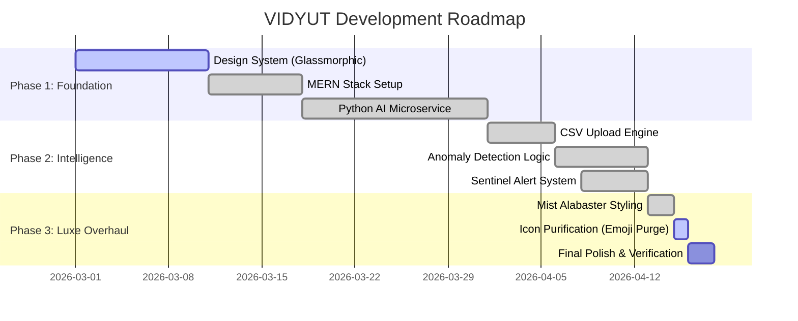
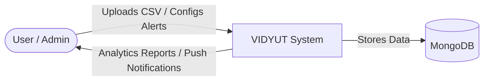
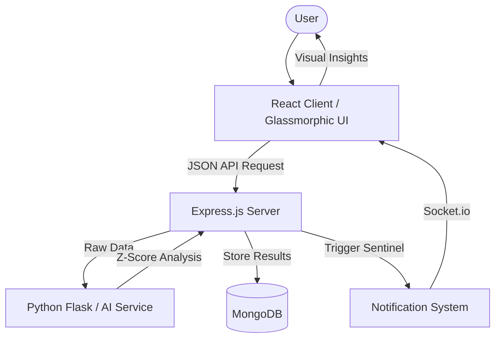
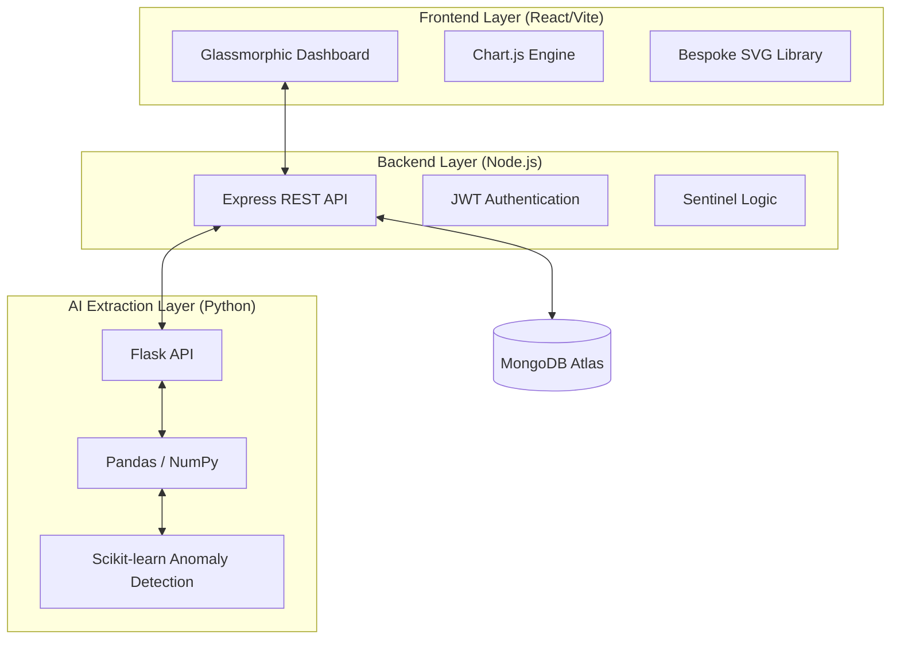
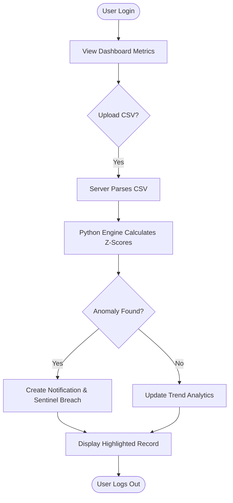
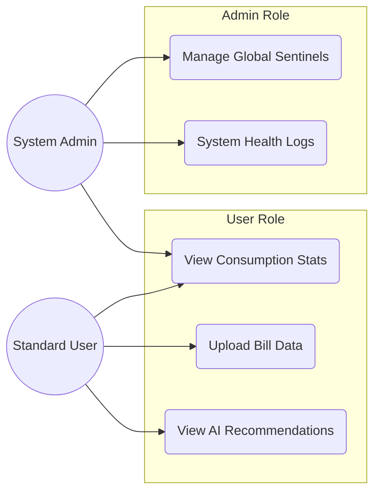
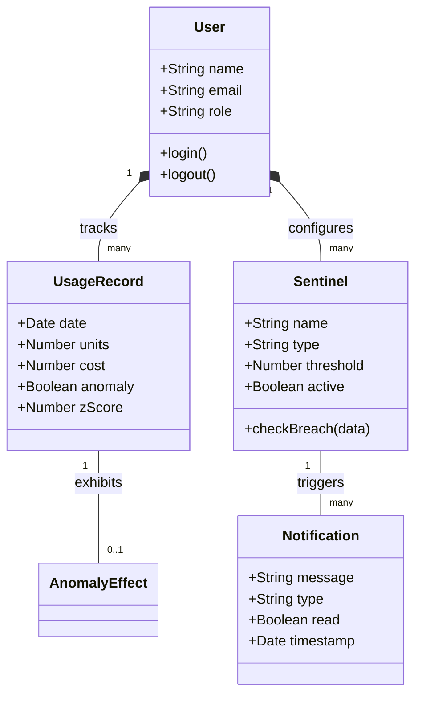

# Technical Engineering Suite - VIDYUT 📊

This suite provides the professional Mermaid diagrams for the VIDYUT Smart Electricity Dashboard. These can be rendered in any Mermaid-compatible viewer (GitHub, VS Code, etc.).

## 1. Project Scheduling (Gantt Chart)
Tracks the evolution from high-fidelity prototype to the current Luxe / Bespoke standard.

---

## 2. Data Flow Diagrams (DFD)

### Context Diagram (Level 0)
The high-level interaction between the user and the system.

### System Decomposition (Level 1)
Detailed flow between the application components and the AI engine.

---

## 3. Block Diagram (System Architecture)
High-level overview of the technology stack and communication layers.

---

## 4. Flowchart (System Process Flow)
Typical journey from data ingestion to real-time alerting.

---

## 5. Use Case Diagram
Defining user and admin interactions with the intelligence suite.

---

## 6. Class Diagram (Data Models)
Relationships between core entities in the VIDYUT database.

